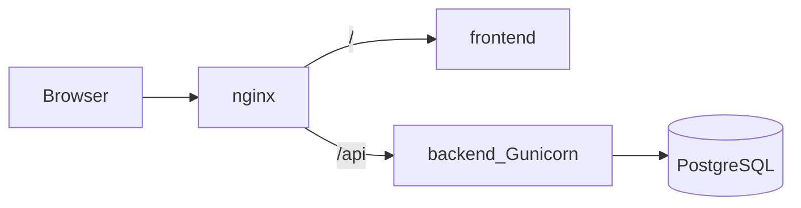

# Arquitetura

## Containers

| Serviço | Tecnologia | Função |
|---------|------------|--------|
| `nginx` | Nginx | Entrada HTTP (porta 80); proxy `/` → frontend, `/api` → backend |
| `frontend` | React + Vite | SPA pública e (futuro) área autenticada / admin |
| `backend` | Django + DRF + Gunicorn | API REST, auth, regras de negócio |
| `db` | PostgreSQL 16 | Persistência |

## Diagrama

## Ambientes

- **Dev** (`docker compose up`): backend com `runserver`, frontend com Vite HMR, volumes de código montados.
- **Prod** (`docker compose -f docker-compose.yml -f docker-compose.prod.yml up`): Gunicorn, build estático do frontend, sem bind mounts de código.

## Multiplataforma

Windows e Linux usam os **mesmos** comandos Docker Compose. Não há dependência de paths nativos do host além do próprio Docker Desktop / Engine.

## Variáveis sensíveis

Definidas em `.env` (nunca versionar senhas reais). Modelo em `.env.example`.
