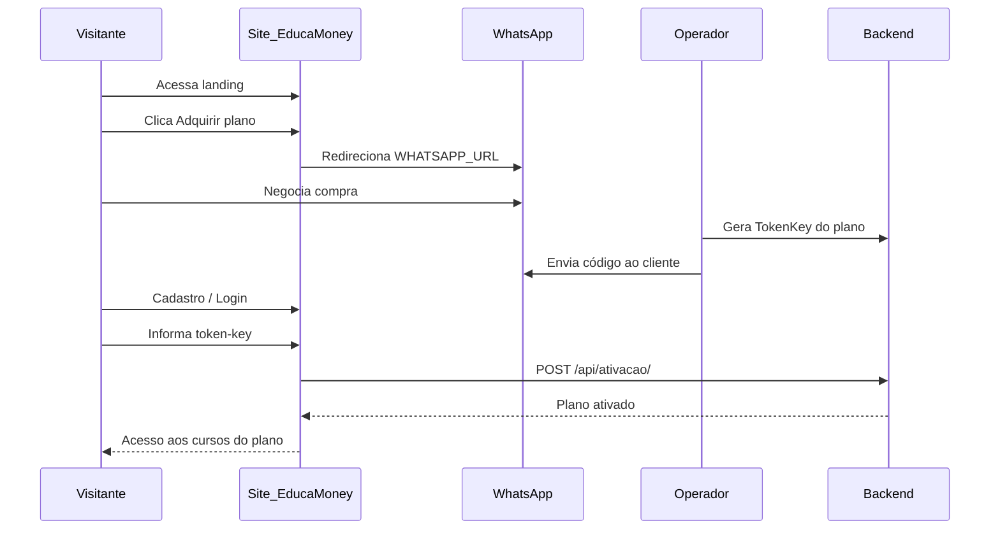
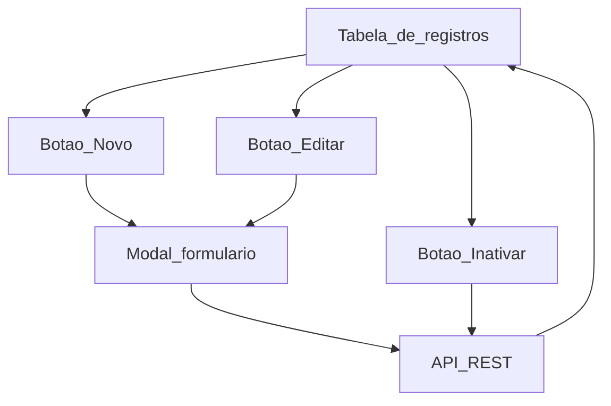
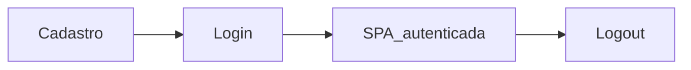

# Fluxos principais

## Aquisição e ativação

```mermaid
sequenceDiagram
  participant V as Visitante
  participant S as Site_EducaMoney
  participant W as WhatsApp
  participant O as Operador
  participant API as Backend

  V->>S: Acessa landing
  V->>S: Clica Adquirir plano
  S->>W: Redireciona WHATSAPP_URL
  V->>W: Negocia compra
  O->>API: Gera TokenKey do plano
  O->>W: Envia código ao cliente
  V->>S: Cadastro / Login
  V->>S: Informa token-key
  S->>API: POST /api/ativacao/
  API-->>S: Plano ativado
  S-->>V: Acesso aos cursos do plano
```

## Admin CRUD (padrão)

```mermaid
flowchart TD
  lista[Tabela_de_registros]
  novo[Botao_Novo]
  editar[Botao_Editar]
  inativar[Botao_Inativar]
  modal[Modal_formulario]
  api[API_REST]

  lista --> novo
  lista --> editar
  lista --> inativar
  novo --> modal
  editar --> modal
  modal --> api
  inativar --> api
  api --> lista
```

## Login / Logout

```mermaid
flowchart LR
  cadastro[Cadastro]
  login[Login]
  spa[SPA_autenticada]
  logout[Logout]

  cadastro --> login
  login --> spa
  spa --> logout
```
